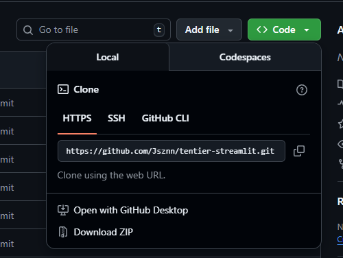

# Panduan Git untuk Deployment Streamlit

## 1. Persiapan Awal (Pertama Kali)

Jika folder proyek belum terhubung dengan Git sama sekali.

```bash
# Inisialisasi Git di folder proyek
git init

# Menambahkan semua file ke staging area
git add .

# Membuat commit pertama
git commit -m "Initial commit: Aplikasi Streamlit siap deploy" #pesan terserah

# Mengubah nama branch utama menjadi 'main' (standar GitHub saat ini)
git branch -M main
```



```bash
# Menghubungkan folder lokal dengan repository GitHub
# Ganti URL_REPOSITORY dengan URL dari repository baru Anda di GitHub
git remote add origin https://github.com/USERNAME/NAMA-REPO.git

# Upload (push) kode ke GitHub
git push -u origin main
```

## 2. Update Rutin (Setelah Ada Perubahan Kode)

Lakukan langkah ini setiap kali Anda selesai mengedit kode (`app.py`, `requirements.txt`, dll) dan ingin memperbarui aplikasi di Streamlit Cloud.

```bash
# Cek status file mana yang berubah
git status

# Tambahkan perubahan ke staging
git add .

# Simpan perubahan dengan pesan yang jelas
git commit -m "Update fitur: Menambahkan chart baru"

# Kirim perubahan ke GitHub (Streamlit akan otomatis refresh setelah ini)
git push
```

## 3. Troubleshooting & Masalah Umum

### A. Salah Remote URL
Jika Anda salah memasukkan URL repository atau ingin menggantinya.

```bash
# Cek remote yang terdaftar saat ini
git remote -v

# Ganti URL origin dengan yang baru
git remote set-url origin https://github.com/USERNAME/REPO-BARU.git
```

### B. Error "Updates were rejected because the remote contains work that you do not have locally"
Ini terjadi jika ada perubahan di GitHub (misalnya Anda edit Readme di browser) yang belum ada di komputer lokal Anda.

```bash
# Ambil perubahan dari GitHub dan gabungkan ke lokal
git pull origin main

# Jika ada konflik, perbaiki file yang konflik, lalu:
git add .
git commit -m "Fix merge conflicts"
git push
```

### C. Membatalkan Perubahan Lokal (Belum di-Commit)
Jika Anda mengedit file tapi berantakan dan ingin kembali ke kondisi terakhir yang bersih.

```bash
# Mengembalikan satu file ke kondisi terakhir commit
git checkout -- nama_file.py

# ATAU mengembalikan SEMUA file ke kondisi terakhir commit (Hati-hati!)
git reset --hard
```

### D. Mengubah Pesan Commit Terakhir
Jika typo saat menulis pesan commit.

```bash
git commit --amend -m "Pesan baru yang benar"
# Jika sudah terlanjur di-push, perlu force push (Hati-hati jika kolaborasi)
git push --force
```

### E. Menangani File Besar (>100MB)
GitHub menolak file di atas 100MB. Anda punya dua pilihan:

**Opsi 1: Jangan Upload (Disarankan)**
Jika file tersebut adalah dataset lokal atau model yang bisa didownload saat runtime, sebaiknya diabaikan.
Buat file `.gitignore` dan isi dengan pola file yang ingin diabaikan:

```text
# Isi file .gitignore
venv/
__pycache__/
*.csv
models/model_besar.pkl
.env
```

**Opsi 2: Gunakan Git LFS (Jika Wajib Upload)**
Jika file besar tersebut (misal model ML) **harus** ada di repo agar aplikasi bisa jalan.

1. **Install Git LFS** (Hanya perlu sekali per komputer)
   ```bash
   git lfs install
   ```

2. **Track File Besar**
   Pilih jenis file yang ingin di-track (misal semua file `.pkl`).
   ```bash
   git lfs track "*.pkl"
   ```
   *Perintah ini akan membuat file `.gitattributes`.*

3. **Commit dan Push seperti biasa**
   ```bash
   git add .gitattributes
   git add .
   git commit -m "Add large model using LFS"
   git push
   ```
   *Note: Streamlit Cloud mendukung Git LFS secara otomatis.*

## 4. Langkah Deployment di Streamlit Cloud

Setelah kode berhasil di-push ke GitHub:

1. Buka [share.streamlit.io](https://share.streamlit.io/).
2. Klik **"New app"**.
3. Pilih Repository, Branch (`main`), dan Main file path (`app.py`).
4. Klik **"Deploy!"**.

---
*Catatan: Pastikan file `requirements.txt` Anda lengkap agar Streamlit Cloud bisa menginstall library yang dibutuhkan.*
